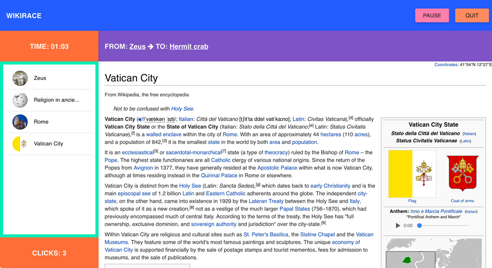

#Wikirace
 > A real-time desktop game inspired by the [wikipedia game](https://en.wikipedia.org/wiki/Wikipedia:Wiki_Game)

VIEW LIVE - https://wikirace.herokuapp.com/

***


##Local Installation
- Installing dependencies/initial setup
```
npm install 
# Please install PostgreSQL to use this command
createdb wikirace
touch .env
```

- Please include a secret jwt key inside the .env file
```
JWT_SECRET=YOUR_SECRET_KEY
```

- Run the application
```
nodemon
```